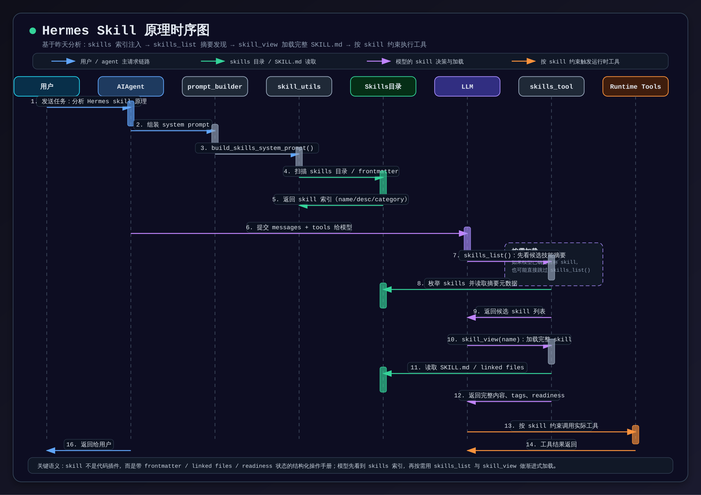

# Hermes Skill 实现原理

## 概述

Hermes 的 skill 体系不是传统插件系统，而是一套**目录化、可索引、可按需加载的程序性知识层**。每个 skill 以 `SKILL.md` 为中心，既能向模型提供任务执行规范，也能携带配置、依赖、附属文件和 readiness 状态。

从运行机制上看，Hermes 先把 skill 的**紧凑索引**注入 system prompt，再让模型按需调用 `skills_list()` 与 `skill_view()`。这是一种典型的**渐进式披露（progressive disclosure）**设计：先给地图，再按需打开细节。

这套机制让 skill 更接近“结构化操作手册”而不是“硬编码插件”。它与 [[harness-engineering]] 中强调的知识地图思路相通，也和 [[anthropic-agent-harness]] 中的上下文管理实践相呼应。

## skill 的文件组织

Hermes skill 的核心载体是一个目录，主文件为 `SKILL.md`。文件一般由 **YAML frontmatter + Markdown 正文** 组成。

常见 frontmatter 字段包括：

- `name`
- `description`
- `platforms`
- `metadata.hermes.tags`
- `metadata.hermes.related_skills`
- `metadata.hermes.config`
- `required_environment_variables`
- `required_credential_files`

一个 skill 目录还可以附带多类 supporting files：

- `references/`
- `templates/`
- `assets/`
- `scripts/`

因此，skill 不是一段单薄提示词，而是一个可携带文档、模板、脚本和资源文件的小型知识包。

## 发现与加载链路

Hermes skill 的典型链路可以概括为四步：

1. `build_skills_system_prompt()` 扫描可用 skill，生成紧凑索引注入 system prompt
2. 模型根据用户任务判断哪些 skill 可能相关
3. 模型先用 `skills_list()` 看候选摘要，再用 `skill_view(name)` 加载完整 skill
4. 模型按 skill 中的规范去选择后续工具和执行流程

这里的关键不是“先把所有 skill 都喂给模型”，而是让模型先看到一个低成本索引。只有真正需要时，才把完整内容加载进上下文。

## 三层结构：索引、按需加载、管理

### 1. 索引层

在构建 prompt 时，`agent/prompt_builder.py` 会通过 `build_skills_system_prompt()` 把 skill 列表整理成模型可读的技能地图。这一层只暴露必要摘要，例如名称、描述、类别和适用方向。

### 2. 按需加载层

- `skills_list()`：返回轻量摘要
- `skill_view()`：返回完整 `SKILL.md`、tags、路径、linked files、setup 信息、readiness 状态

这一分层就是 Hermes skill 的核心设计：**摘要发现 + 全文加载**。

### 3. 管理层

`skill_manage()` 支持 create / patch / edit / delete / write_file 等动作。也就是说，skill 不是只读资产，而是可随实践演进的程序性记忆。

## 过滤、优先级与扩展

Hermes 在技能发现阶段还会做多种过滤与优先级处理。

### 平台过滤

`skill_matches_platform(frontmatter)` 根据 `platforms` 字段和当前系统平台做匹配，例如：

- `macos -> darwin`
- `linux -> linux`
- `windows -> win32`

### 禁用配置

`get_disabled_skill_names()` 会读取配置中的：

- `skills.disabled`
- `skills.platform_disabled.<platform>`

被禁用的 skill 不会进入可用清单。

### 外部目录

除了 `~/.hermes/skills/` 之外，Hermes 还可以通过 `skills.external_dirs` 加载额外目录中的技能。

### 本地优先

若本地目录与 external dirs 中有重名 skill，本地版本优先，外部版本会被跳过。

### plugin:skill

`skill_view(name)` 支持 `plugin:skill` 命名空间，因此 skill 还可以来自插件系统，而不只是磁盘目录。

## 配置注入与 readiness

Hermes skill 的一个重要特征，是它不仅告诉模型“怎么做”，还说明“当前是否已经具备执行条件”。

### 配置注入

`_inject_skill_config()` 可以根据 `metadata.hermes.config` 从 `~/.hermes/config.yaml` 读取配置，并把实际值附加到 skill 上下文里。

### 环境检查

skill 可声明：

- `required_environment_variables`
- `required_credential_files`

`skill_view()` 返回结果中会带出：

- `setup_needed`
- `setup_skipped`
- `setup_note`
- `gateway_setup_hint`
- `missing_required_environment_variables`
- `missing_credential_files`
- `readiness_status`

因此，skill 不是死文档，而是带“可执行前状态”的任务对象。

## 对模型行为的影响

Hermes 的 system prompt 对 skill 的使用要求非常强。它不是把 skill 当作参考阅读材料，而是要求模型：

- 回答前先扫描 skills
- 命中相关技能时优先 `skill_view(name)`
- 如果发现 skill 过时或错误，应该使用 `skill_manage(action='patch')` 去修补

这意味着 skill 直接影响模型的工具选择、排障顺序、浏览器策略、测试流程和交付格式。实际运行里，它更像一个“任务执行协议层”。

## 时序图

下面这张图总结了“skills 索引注入 → 摘要发现 → 完整加载 → 按 skill 约束执行工具”的主链路。

- PNG 预览：`assets/diagrams/hermes-skill-sequence-2026-04-16.png`
- SVG 源文件：`assets/diagrams/hermes-skill-sequence-2026-04-16.svg`

## 核心判断

Hermes skill 体系可以概括为四句话：

1. 它是**可索引的知识单元**，不是一开始就全文注入的提示块。
2. 它是**按需加载的工作流规范**，通过 `skills_list()` 和 `skill_view()` 渐进展开。
3. 它是**带元数据与 readiness 的任务模块**，可表达平台、配置、依赖与支持文件。
4. 它是**可维护的程序性记忆**，能在实践中被 patch、更新、扩展。

## 与其他概念的关系

- [[harness-engineering]]：都强调给 Agent 一张可导航的地图，而不是一次性塞满上下文。
- [[anthropic-agent-harness]]：都把上下文管理、渐进式读取和任务脚手架视为可靠性的关键。
- [[claude-code]]：Hermes 的很多 coding / tooling skill 最终都服务于类似编码 Agent 的长期工作流。

## 开放问题

- 未来 Hermes 是否会把 skill 的选择与调用历史纳入更显式的反馈学习？
- `skill_manage()` 演化出来的 skill 质量，如何自动评估与回归测试？
- 当 skill 数量继续增长时，skills 索引压缩策略是否会成为新的瓶颈？
